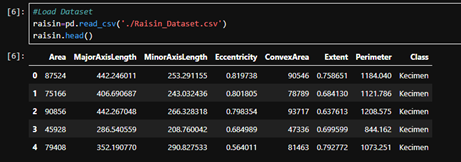
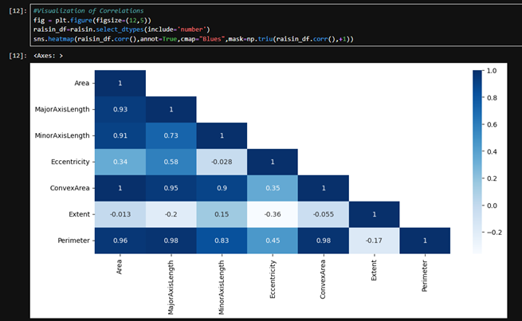

# DATA 1200 Assignment

## SVM and Naive Bayes Classification on the Raisin Dataset

### Course Information

- Course: `DATA 1200`
- Assignment: `Machine Learning Classification`
- Topic: `Support Vector Machine and Gaussian Naive Bayes`

### Student Information

- Student Name: `Joan Dela Cruz`
- Instructor: `Ritwick Dutta`
- Submission Date: `March 23, 2026`


This repository contains a Jupyter Notebook assignment that explores the `Raisin_Dataset.csv` dataset and compares two classification models:

- Support Vector Machine (SVM)
- Gaussian Naive Bayes

The notebook performs basic exploratory data analysis, visualizes feature relationships, prepares the data for modeling, and evaluates both classifiers.

## Repository Contents

- `Assignment-Data1200.ipynb` - main notebook for the assignment
- `Raisin_Dataset.csv` - raisin classification dataset used in the analysis
- `README.md` - project overview and usage instructions

## Project Workflow

The notebook includes the following steps:

1. Load required Python libraries
2. Load the raisin dataset
3. Review descriptive statistics
4. Visualize numeric correlations with a heatmap
5. Create a pairplot by class
6. Split the data into training and test sets
7. Standardize the feature values
8. Train and evaluate SVM and Gaussian Naive Bayes models

## Dataset Overview

The dataset contains 900 rows and 8 columns:

- 7 numeric feature columns
- 1 target column: `Class`

The two target classes are:

- `Kecimen`
- `Besni`

Feature columns:

- `Area`
- `MajorAxisLength`
- `MinorAxisLength`
- `Eccentricity`
- `ConvexArea`
- `Extent`
- `Perimeter`

## Tools and Libraries

The notebook uses the following Python libraries:

- `pandas`
- `numpy`
- `matplotlib`
- `seaborn`
- `scikit-learn`

## Installation

Install the following Python packages before running the notebook:

```bash
pip install pandas numpy matplotlib seaborn scikit-learn notebook
```

## How To Run

1. Open a terminal in this project folder.
2. Start Jupyter Notebook:

```bash
jupyter notebook
```

3. Open `Assignment-Data1200.ipynb`.
4. Run the cells from top to bottom.

## Analysis and Model Evaluation

The notebook produces:

- summary statistics for the dataset
- a correlation heatmap
- a pairplot colored by class
- confusion matrices for each model
- classification reports for each model

## Expected Learning Outcomes

This assignment helps demonstrate how to:

- explore a structured dataset using descriptive statistics
- visualize relationships between variables
- prepare data for machine learning
- apply feature scaling before model training
- compare multiple classification algorithms
- evaluate model performance with confusion matrices and classification reports

## Sample Screenshots





## Purpose

This assignment demonstrates a basic machine learning workflow for binary classification, including:

- exploratory data analysis
- feature scaling
- train/test splitting
- model comparison
- performance evaluation

## Notes

- The notebook uses an 80/20 train-test split.
- Feature scaling is applied before training the models.
- The target variable is `Class`, which contains the raisin categories `Kecimen` and `Besni`.
